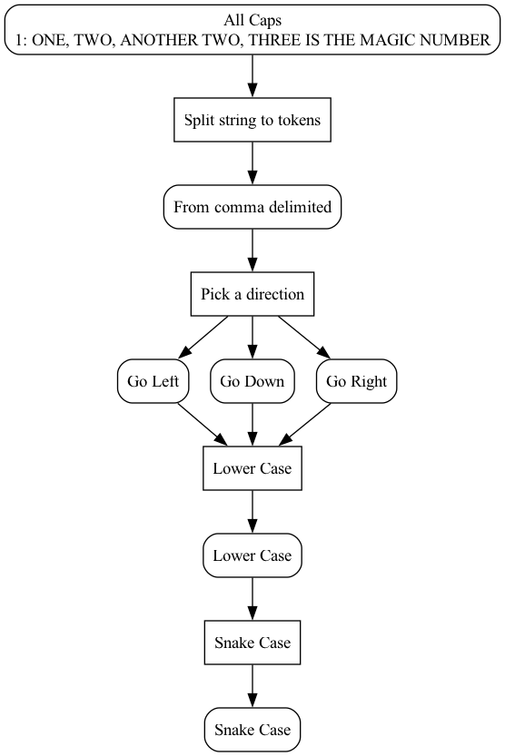
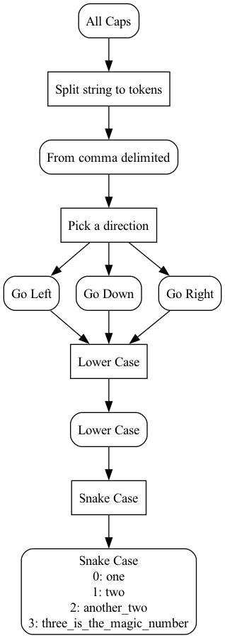

## Overview
A minimalistic, Petri net based tool, for data processing.
This is an early version, feel free to get in touch or open an issue if you have any questions or suggestions.

A Petri net is a bipartite graph consisting of place nodes and transition nodes connected by edges called arcs.
Each place node can hold "tokens". When a transition fires, tokens in the input and output place nodes are updated according to the rules of the transition.

This library provides functions for constructing Petri nets in which tokens are associated with data and transitions hold functions for processing this data.
Note, this is not intended to a be a general purpose Petri net simulator but rather a tool to help structure data processing pipelines.

The user defines the Petri net graph, the data associated with each token and the functions to be called when a transition fires.
The goal is to help structure data processing pipelines and make them extensible.

### When Not to Use This
If your data processing can be easily composed from pure function calls, you probably don't want to use this. Some things to consider:
1. For simple tasks, the extra code needed to set up the Petri net may be a source of unnecessary complexity.
2. Operations on the Petri net produce mutable states which can be hard to keep track of. Does order of processing matter?
3. The Petri Net formalism is powerful and should be used with care. Cycles, deadlocks and infinite loops are all possible and can be difficult to debug.

### When to Use This
You may want to use this if you have to deal with a complex stateful processes. Here are some ways in which this library may be useful:
1. Petri nets lend themselves to visualisation and can be used to help structure complex data processing pipelines.
2. When the outcomes of individual data processing steps are not easily predictable or not deterministic, the Petri net structure can encode how different cases are handled and how the order of processing is determined.
3. The formalism of tokens, places and transitions may be helpful in creating interfaces between different stages of the process.
Such interfaces can compartmentalise data transformation steps, making them easier to reason about.

I have found this to be useful for processes that requires a lot of calls to stateful external data sources, with the data flow paths depending on the responses.
In particular, if all the possible paths can not be known in advance, the Petri Net structure can help to reason about how to handle new cases as they arise.

## Constraints
Place and transition nodes must be unique. Tokens do not need to be unique.

### Transition Priority Functions
Each transition has a priority function associated with it.
When using library functions, the transition for which the priority is computed to be the highest will be selected to fire next.
You can provide your own transition priority function which takes in the input and output place nodes or you can use a built in function that simply returns a pre-determined constant value.
*** If a transition priority is computed to be zero, the transition does not fire. ***

### Token Priority
A value associated with each token that can be used to determine which token is selected to be processed next.

### Arc Direction
Arcs between places and transitions can be either input (ArcIn) or output arcs (ArcOut).
This is used to help structure the Petri net.
However, given that transitions can call arbitrary functions and affect both the input and output places, information can flow in both directions.

### Defining a Petri Net
A petri net can be constructed by declaring instances of Transition, Place, ArcIn, ArcOut and Token classes.
Wrapper functions for commonly used operations are also provided to help make the code more concise. See `branching_cases_detailed.py` and `branching_cases_simplified.py` for a comparison.

## Examples
See the `examples` directory for how this can be used.

Example graphs with tokens before and after processing. Place nodes have rounded corners and transition nodes have square corners.
Numbered lists inside the place nodes correspond to the tokens.

 
